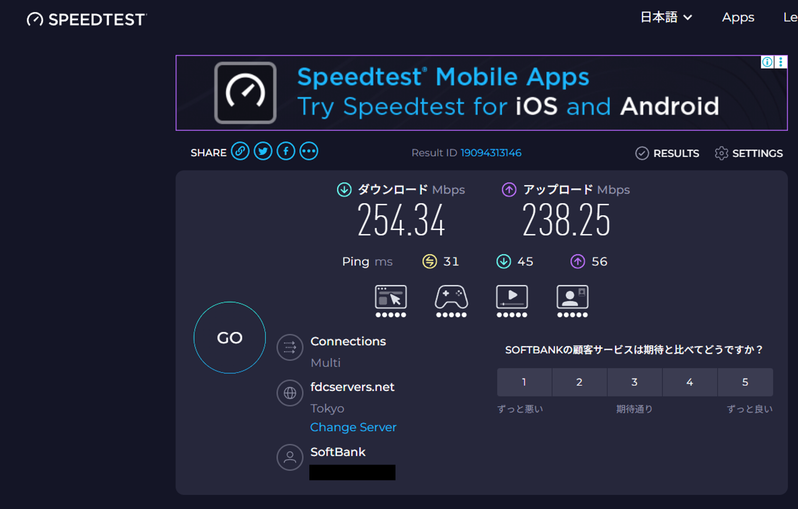
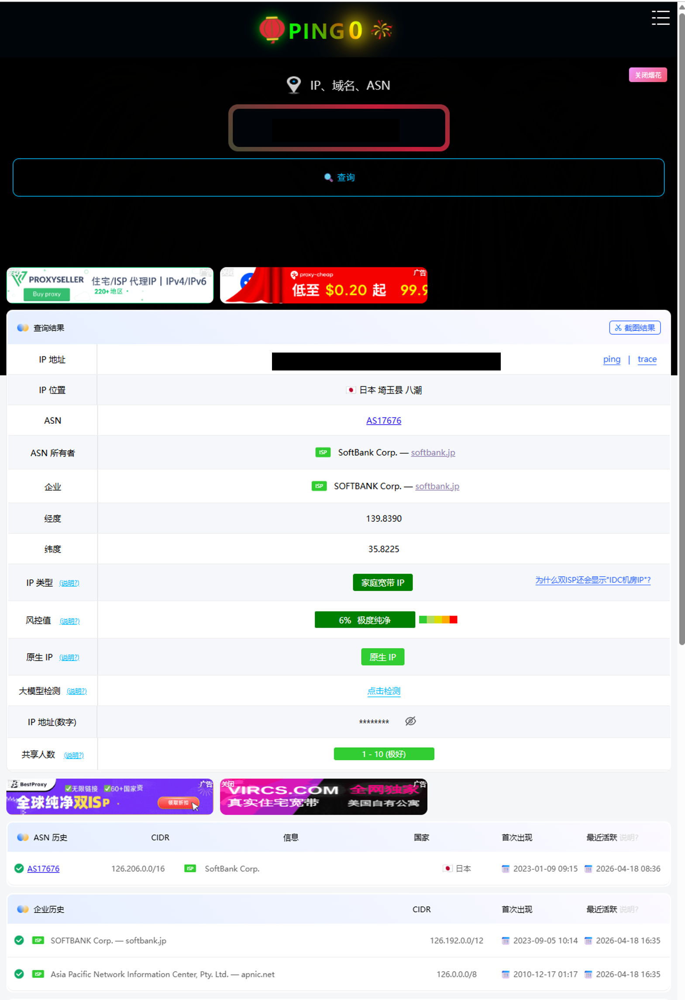

# Traffic Forge 试用邀请码｜VPN 机场免费试用

> **Traffic Forge** 是一家主打日本 SoftBank 原生住宅 IP 的 VPN 机场（科学上网 / 翻墙代理服务），支持 Clash、Sing-box、V2rayN、Shadowrocket 等主流客户端。
>
> 本仓库每周公布 **10 个 Traffic Forge 试用邀请码**，新用户可凭邀请码在官网注册并免费领取试用订阅。

**关键词**：VPN · 机场 · 科学上网 · 梯子 · 翻墙 · SoftBank 住宅 IP · Clash · Sing-box · V2rayN · Shadowrocket · Trojan · Hysteria2

## 节点质量

主打 **日本 SoftBank 原生住宅 IP**，低延迟、高带宽、IP 纯净度高，适合需要高 IP 质量的场景（如 ChatGPT、Claude 等 AI 服务）。

### 带宽 & 延迟（东京节点）

    

Speedtest 实测（东京 SoftBank 节点）：下载 **254 Mbps**，上传 **238 Mbps**，Ping **31 ms**。

> 实际速度可能因用户所在地区、本地 ISP、接入线路及时段差异而上下浮动，以上数据仅供参考。

### IP 纯净度

    

ASN 归属 **SoftBank Corp.**（日本原生住宅 IP，非数据中心），风控评分 **0.20 / 99.5**。

## 本周邀请码

最新一期：[invite-codes/2026-04-18.md](invite-codes/2026-04-18.md)

## 使用流程

1. 从 [本周邀请码](invite-codes/2026-04-18.md) 中复制一个未被使用的邀请码
2. 打开 <https://www.kyosweb.com/register>
3. 注册时填入邀请码
4. 登录后台获取订阅链接，导入 Clash / Sing-box / V2rayN 等客户端即可

## 更新频率

每周一更新 10 个新邀请码。历史邀请码会保留在 [invite-codes/](invite-codes/) 目录下作为存档。

## 链接

- 官网：<https://www.kyosweb.com>
- 注册：<https://www.kyosweb.com/register>

## 说明

- 邀请码先到先得，用完为止
- 试用期结束后可在官网购买正式套餐
- 邀请码仅用于首次注册，不可叠加

---

Tags: `vpn` `机场` `airport` `科学上网` `梯子` `翻墙` `proxy` `clash` `sing-box` `v2ray` `shadowrocket` `trojan` `hysteria2` `softbank` `japan-vpn` `invite-code` `邀请码` `免费试用`
